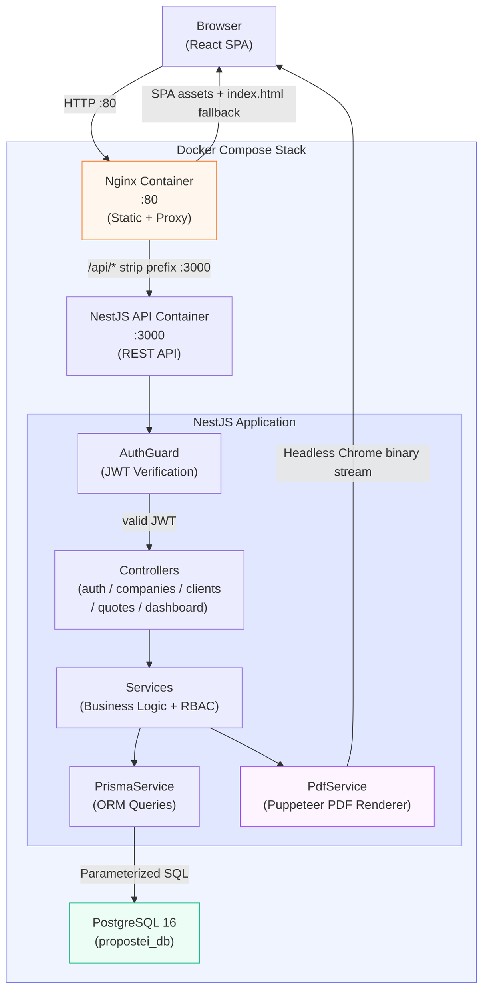

# Propostei — B2B Commercial Proposal Management Platform

> **Public Showcase Notice:** This repository exists as a portfolio-grade demonstration of software architecture, engineering decisions, and technical depth. The complete production source code is proprietary. What is presented here reflects the architectural design, technology choices, and key engineering challenges of the real system.

---

## Short Description

**Propostei** is a full-stack, multi-tenant B2B SaaS platform purpose-built for service businesses to create, track, and close commercial proposals at scale. It combines a clean NestJS REST API, a React 19 single-page application, server-side PDF generation via headless Chrome, and a role-based multi-company workspace model — all shipped as a single, production-grade Docker Compose stack.

---

## Key Visuals / Demo

> Screenshots and screen-recording GIFs will be added here.

| Dashboard Overview | Quote Builder | PDF Output |
|---|---|---|
| 
 | `[ screenshot / GIF ]` | `[ screenshot / GIF ]` |

| Client Management | Quote Detail View | Auth Flow |
|---|---|---|
| `[ screenshot / GIF ]` | `[ screenshot / GIF ]` | `[ screenshot / GIF ]` |

---

## Tech Stack & Tools

### Frontend
| Technology | Version | Purpose |
|---|---|---|
| React | 19.2.6 | UI framework |
| TypeScript | 5.x | Static typing |
| Vite | 8.0.12 | Build toolchain & dev server |
| React Router | 7.17.0 | Client-side routing |
| Tailwind CSS | 4.3.0 | Utility-first styling |
| Radix UI | Latest | Accessible headless component primitives |
| Recharts | 3.8.1 | Dashboard data visualization |
| Axios | 1.17.0 | HTTP client with interceptors |
| Lucide React | Latest | Icon system |
| clsx / tailwind-merge | Latest | Conditional class management |

### Backend
| Technology | Version | Purpose |
|---|---|---|
| NestJS | 11.0.1 | Modular Node.js framework |
| TypeScript | 5.x | Static typing |
| Prisma ORM | 7.8.0 | Type-safe database access |
| @prisma/adapter-pg | 7.8.0 | Native PostgreSQL driver adapter |
| Puppeteer | 25.1.0 | Headless Chrome PDF rendering |
| @nestjs/jwt | 11.0.2 | JWT authentication |
| bcrypt | Latest | Password hashing |
| class-validator | 0.15.1 | DTO input validation |
| class-transformer | 0.5.1 | Request payload transformation |

### Database
| Technology | Version | Purpose |
|---|---|---|
| PostgreSQL | 16 | Primary relational data store |
| Prisma Migrations | 7.8.0 | Schema versioning & automated migrations |

### Infrastructure & DevOps
| Technology | Purpose |
|---|---|
| Docker | Containerization (multi-stage builds for both API and web) |
| Docker Compose | Multi-service orchestration (dev + production configs) |
| Nginx (Alpine) | Static asset serving, SPA fallback routing, API reverse proxy |
| Node.js 24 (slim) | API runtime |
| npm workspaces | Monorepo dependency management |

---

## System Architecture

### End-to-End Data Flow

The system is structured as a **three-tier containerized application** where every layer has a single, well-defined responsibility.

**User Request Flow:**

1. The browser makes a request to the Nginx container on port `80`.
2. Nginx routes the request based on the path prefix:
   - Requests matching `/api/*` are **reverse-proxied** to the NestJS API container on port `3000`. The `/api` prefix is stripped before forwarding, so the API receives clean paths (e.g., `/companies`, `/auth/login`).
   - All other requests are served from the pre-built React SPA static bundle. Unknown paths fall back to `index.html`, enabling client-side routing via React Router.
3. The NestJS API processes the request:
   - **AuthGuard** intercepts every protected route, extracts the `Authorization: Bearer <token>` header, verifies the JWT signature against `JWT_SECRET`, and attaches the decoded `JwtPayload` (id, name, email) to the request context.
   - The appropriate **Controller** receives the validated, typed request body (enforced by `ValidationPipe` + `class-validator` DTOs).
   - Business logic in the **Service** layer performs authorization checks (is this user a member of the target company? do they have the required role?), executes database queries, and computes derived values (e.g., quote totals).
   - The **PrismaService** executes parameterized queries against PostgreSQL 16, using `Prisma.Decimal` for all monetary arithmetic to avoid IEEE 754 floating-point errors.
4. For PDF generation, the **PdfService** spins up a Puppeteer headless Chrome instance, renders a server-side HTML template with full Tailwind CSS styling, and returns the binary PDF stream via an unauthenticated public endpoint identified by a `publicToken` UUID.
5. PostgreSQL persists all state and enforces referential integrity via Prisma-managed foreign key constraints.

**Authentication & Authorization Flow:**

- On registration (`POST /auth/signup`), the password is hashed with bcrypt before storage. A user record is created with no company membership.
- On login (`POST /auth/login`), bcrypt compares the submitted password against the stored hash. On success, `JwtService.sign()` issues a short-lived signed token containing `{ id, name, email }`.
- The React `AuthContext` stores this token in `localStorage`, validates the `exp` claim on every page load, and automatically clears expired sessions.
- An Axios request interceptor attaches the token to every outbound API request as a `Bearer` header — no manual header management required in any page component.

**Multi-Tenancy Data Isolation:**

Every database query for company-scoped resources (clients, quotes, dashboard) is filtered by both `companyId` and user membership — a pattern enforced uniformly at the Service layer, not at the database level. This means a valid JWT cannot be used to access data from a company the user does not belong to.

### Architecture Diagram

---

## Core Engineering Challenges & Solutions

### Challenge 1: Financial Precision in a Node.js/JavaScript Environment

**The Challenge:**

JavaScript's native `number` type uses IEEE 754 double-precision floating point, which produces rounding errors in arithmetic that are unacceptable in financial contexts (e.g., `0.1 + 0.2 === 0.30000000000000004`). A commercial proposal platform dealing with subtotals, line-item prices, discounts, and final totals must produce cent-accurate results across potentially dozens of line items per quote and thousands of quotes per company.

**The Solution:**

All monetary columns in the PostgreSQL schema are declared as `Decimal(10, 2)` — a fixed-precision numeric type with no floating-point representation at the storage level. Prisma maps these columns to the `Prisma.Decimal` class at the TypeScript layer, which wraps arbitrary-precision arithmetic and never converts to a native JS `number` during computation.

All derived monetary values are computed **exclusively on the server** inside `QuotesService`. The computation chain is deterministic and closed: `item.total = quantity × unitPrice` (Decimal multiplication), `subtotal = ∑ item.total` (Decimal summation via `.reduce()`), `total = subtotal − discount` (Decimal subtraction). The client is never trusted to send pre-calculated totals — the API ignores any `total` field in the request body and recalculates it unconditionally. This eliminates an entire class of data integrity bugs, prevents client-side manipulation of financial values, and ensures the PDF output always reflects the database-authoritative number.

---

### Challenge 2: Enforcing a Subscription Plan Limit Under Concurrent Requests

**The Challenge:**

The business rule requires that users on the `FREE` subscription tier can only create a single company. A naive implementation — query the membership count, check if it is below the limit, then insert — is vulnerable to a **Time-of-Check / Time-of-Use (TOCTOU) race condition**: two simultaneous `POST /companies` requests from the same user can both read a count of zero, both pass the guard, and both proceed to insert, resulting in a FREE user owning multiple companies without paying. This is a classic concurrency bug that standard application-level checks cannot solve.

**The Solution:**

The company creation logic in `CompaniesService` is wrapped entirely inside a **Prisma interactive transaction** (`prisma.$transaction(async (tx) => { ... })`). Inside the transaction, the service first performs a `tx.companyMember.findFirst` to count existing OWNER memberships for the user, using the same transaction client. If the count violates the plan limit, the transaction is aborted immediately with a `ForbiddenException`.

If the check passes, the `Company`, the initial `CompanyMember` (with `OWNER` role), and the `Subscription` (defaulting to `FREE/ACTIVE`) are all created within the same atomic unit of work using the transactional client `tx`. Because PostgreSQL serializes conflicting writes within the transaction boundary, a concurrent request attempting the same operation will block until the first transaction either commits or rolls back — at which point the second request will see the newly committed membership record and correctly fail the plan limit check. This guarantees exactly-once enforcement with no distributed locking, no application-level mutexes, and no risk of partial data being written to the database.

---

### Challenge 3: Server-Side PDF Generation with Full CSS Fidelity via Headless Chrome

**The Challenge:**

Generating professional-grade commercial proposal PDFs from a web server is deceptively difficult. Programmatic PDF libraries (e.g., `pdf-lib`, `pdfkit`) require constructing documents imperatively — explicit coordinates, manual font metrics, custom page-break logic — making it expensive to maintain and virtually impossible to replicate a high-fidelity designed layout. Client-side generation (e.g., `html2canvas` + jsPDF) depends entirely on the user's browser rendering context, cannot be triggered from a background job, and is incompatible with the requirement of serving PDFs via a public shareable link that the client's customer can open without an account.

**The Solution:**

The architecture introduces a dedicated `PdfService` backed by **Puppeteer** — a headless Chromium instance running inside the API Docker container. The PDF template is authored as a fully self-contained HTML document with embedded Tailwind-compiled CSS. At request time, `PdfService` creates a Puppeteer browser page, calls `page.setContent(htmlString)` with server-populated data (company branding, client details, itemized table, Brazilian Portuguese currency and date formatting via `Intl`), waits for the page to render, and calls `page.pdf({ format: 'A4', printBackground: true, margin: {...} })` to produce the binary PDF buffer, which is streamed back in the HTTP response.

The access control model is equally deliberate: each `Quote` record has a `publicToken` UUID column, generated at creation time (via `@default(uuid())`). The endpoint `GET /propostas/:token/pdf` is explicitly excluded from `AuthGuard` — it is a fully public route. This allows the platform to send clients a direct PDF link without requiring them to have an account, while the 128-bit UUID token space (2¹²² combinations) renders enumeration attacks computationally infeasible. The response carries `Content-Type: application/pdf` and `Content-Disposition: inline` headers, opening directly in the browser's native PDF viewer or triggering a file download depending on the client.

---

## Architecture & Design Patterns

### Layered / Modular Architecture (NestJS Feature Modules)

The backend is organized around **NestJS feature modules**, where each business domain (`auth`, `companies`, `clients`, `quotes`, `dashboard`, `prisma`) is a self-contained module encapsulating its own controller, service, DTOs, and module registration. This mirrors a strict **Layered Architecture**:

- **Presentation Layer:** Controllers handle HTTP routing, request/response shaping, and guard declarations. They contain zero business logic — they receive a validated request, call the appropriate service method, and return the result.
- **Business Logic Layer:** Services contain all domain rules — authorization checks, financial calculations, state machine transitions, plan enforcement, and database query composition. They are the only layer aware of business invariants.
- **Data Access Layer:** `PrismaService` extends `PrismaClient` and is injected as a singleton. No raw SQL anywhere in the codebase; all queries are type-safe Prisma operations with compile-time validation against the schema.

### Dependency Injection (NestJS IoC Container)

Every service, guard, and cross-cutting concern is wired through NestJS's built-in IoC container. Controllers declare their service dependencies in the constructor signature; the framework resolves and instantiates them at startup with the correct lifecycle scope. `PrismaModule` is declared `@Global()`, making `PrismaService` available across all feature modules without requiring per-module imports. This makes unit testing straightforward — any service can be isolated by providing a mock implementation of `PrismaService` via NestJS's `TestingModule` builder.

### Data Transfer Objects (DTO Pattern) with Strict Validation

Every inbound request payload is defined and validated through a dedicated DTO class decorated with `class-validator` annotations (`@IsString()`, `@IsEmail()`, `@IsOptional()`, `@IsDecimal()`, `@ArrayMinSize()`, etc.). The global `ValidationPipe` is configured with `whitelist: true` and `forbidNonWhitelisted: true`: any property not declared in the DTO is either silently stripped or rejected with a structured `400 Bad Request`. This creates a strict, self-documenting contract between the API surface and the internal service layer, preventing mass-assignment vulnerabilities and ensuring consistent error responses without any manual validation boilerplate in controllers or services.

### Role-Based Access Control (RBAC) at the Service Layer

Authorization is deliberately implemented at the **Service layer**, not exclusively through route-level decorators. Every service method that creates or mutates data performs a `CompanyMember` lookup to verify that the `@CurrentUser()` (the decoded JWT payload injected via a custom NestJS parameter decorator) holds an `OWNER` or `ADMIN` role within the target company. This enforces the principle that privileged operations are guarded at the domain logic boundary — it is architecturally impossible to bypass the role check by forgetting a decorator, because the check lives alongside the operation it protects.

The three roles map to distinct capability levels: `OWNER` has full company management rights; `ADMIN` can create and edit clients and quotes; `MEMBER` has read-only access to company data. Role assignment is immutable via the current API surface — only the `OWNER` role is granted at company creation time.

### Finite State Machine for Quote Lifecycle

The `Quote.status` column follows a well-defined state transition graph: `DRAFT → SENT → VIEWED → APPROVED | REJECTED | CANCELED | EXPIRED`. Rather than exposing a generic `PATCH { status }` endpoint (which would require complex client-side and server-side validation of valid transitions), the backend exposes **dedicated action endpoints**: `/send`, `/approve`, `/reject`, `/cancel`. Each endpoint validates the quote's current state before applying the transition and sets the corresponding audit timestamp (`approvedAt`, `rejectedAt`). This design prevents invalid state transitions, makes the API surface self-documenting, and creates a clean, implicit audit trail of all lifecycle events.

### Composite Index Strategy for Multi-Tenant Query Performance

The Prisma schema defines explicit `@@index` declarations on all high-cardinality foreign key columns: `CompanyMember.[userId]`, `CompanyMember.[companyId]`, `Client.[companyId]`, `Quote.[companyId]`, `Quote.[clientId]`, and `QuoteItem.[quoteId]`. All list queries in the service layer filter on these indexed columns as the primary predicate, ensuring that as the dataset grows across thousands of tenants, each company's data retrieval degrades logarithmically (B-tree index scan) rather than linearly (sequential table scan). This is foundational for a multi-tenant system where millions of rows may exist but each tenant must only see and wait for their own slice.

### Multi-Stage Docker Builds for Minimal, Secure Production Images

Both the API and web `Dockerfile.prod` files use **multi-stage builds**. A `builder` stage installs all `devDependencies`, compiles TypeScript via `nest build` (API) or bundles via `vite build` (web), then discards the entire build toolchain. The final `runner` (Node.js slim) or `nginx` (Alpine) stage copies only compiled artifacts and production `node_modules` — resulting in images with no TypeScript compiler, Vite, source maps, or development tooling. The Nginx image ships with a purpose-built `nginx.prod.conf` that handles three concerns in a single config: static asset caching with long-lived `Cache-Control` headers, API reverse proxying with prefix rewriting (`/api/` → `/`), and SPA history-mode fallback (`try_files $uri $uri/ /index.html`).

---

## Production & Scaling Note

This repository is a **public engineering showcase**. It demonstrates the architectural foundations, technology choices, and key engineering decisions behind the Propostei platform. The full production source code — including complete business logic, all database migrations, production environment configurations, and the complete frontend implementation — is maintained in a private repository.

The patterns and decisions documented here represent real implementation choices made in a production-deployed system, not theoretical or simplified examples.

For technical inquiries or collaboration opportunities, reach out via the contact information on the profile.
